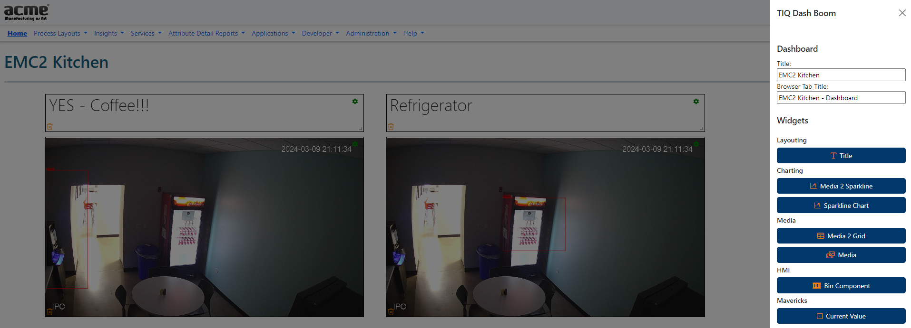

# TIQ-Dash-Boom

TIQ-Dash-Boom is an open type-based dashboarding framework for the SMIP. Dashboards can be created by instantiating an instance of the dashboard type anywhere in the instance tree.

Dashboard instances have a type-based display script that will let you configure a real-time dashboard using widgets available to you. First open widgets available in this library include title, value right now, and sparkline.

<b>Fig.1 - Widgets Collection</b>

The images below show a simple dashboard containing a title widget, a couple of sparklines and two value widgets in both, the configure state and the diplay state. In the configure state, any widget can be configured using the cog-wheel icon and a pop-up. In the display state borders of widgets will be removed together with the cog-wheel icons, and widgets will refresh by default every 5 sec.

<b>Fig.2 - Dashboard in Configure State</b>

<b>Fig.3 - Dashboard in Display State</b>

Widgets can be created using inheritance and organized in other propriatary libraries. For instance, widgets available in the vision add-on library include media, sparkline from vision and grid from vision widgets.
